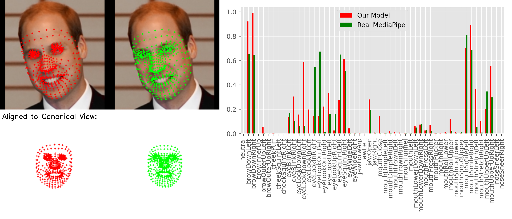

# PyTorch FaceMesh

Pure PyTorch, fully differentiable implementation of Google's MediaPipe [Face Mesh](https://github.com/google-ai-edge/mediapipe/wiki/MediaPipe-Face-Mesh) (also known as [Face Landmarker](https://ai.google.dev/edge/mediapipe/solutions/vision/face_landmarker)), which is currently only distributed as a tflite file (not differentiable, not PyTorch-compatible).

Cobbled together from these existing repositories:
- [deconstruct-mediapipe](https://github.com/nlml/deconstruct-mediapipe)
- [mediapipe_pytorch](https://github.com/tiqq111/mediapipe_pytorch)
- [BlazeFace_PyTorch](https://github.com/hollance/BlazeFace-PyTorch)
- [facenet-pytorch](https://github.com/timesler/facenet-pytorch)

and my best guess at how these components should be pieced together based on the [Model Card](https://storage.googleapis.com/mediapipe-assets/Model%20Card%20MediaPipe%20Face%20Mesh%20V2.pdf).

Though not a perfect replica of Google's version, this implementation can be helpful if you need a fully differentiable, PyTorch approximation of the pipeline.

<div align="center">
    
</div>

## Install
Requires Python 3. Developed and tested in Python 3.9.23 in MacOS.

1. Clone repo and submodules
    ```
    git clone https://github.com/Hadleigh-Schwartz/pytorch_facemesh.git
    git cd pytorch_facemesh
    git submodule init
    git submodule update
    ```
2. Install dependencies
    ```
    pip install -r requiremets.txt
    ```

## Usage
Functionality is unified in the ```PyTorchMediapipeFaceLandmarker()``` class in [```mp_facemesh.py```](mp_facemesh.py).
The forward pass of the model takes an image and outputs the landmarks, blendshapes, and a cropped and padded face extracted from the input iamge.

See a comparison of the PyTorch implementation and official implementation by running
```
python test_mp_facemesh.py
```
This script also demonstrates usage of the ```PyTorchMediapipeFaceLandmarker()``` class. It also provides a webcam-based demo for visualizing the model output vs. real MediaPipe output in real-time.
